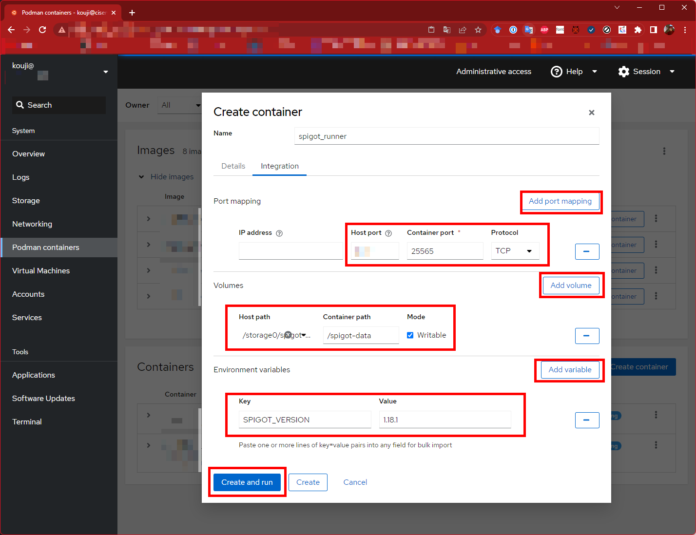

# Automatic minecraft spigot builder and runner on podman (docker).

[docker.io kekyo/spigot_runner](https://hub.docker.com/repository/docker/kekyo/spigot_runner)

[For english](README.md)

これは、podman (docker)を使って、完全自動でspigotサーバーを立ち上げるためのスクリプトです。

* [spigot](https://www.spigotmc.org/)とは、minecraft serverの拡張版、いわゆる"MOD"です。
* spigotだけでは、ほぼ純正のminecraft serverと変わりありません。ここにコミュニティが開発した各種MODを適用することで、様々な拡張機能をサーバーに追加することができます。
* spigot自体は、純正のminecraft serverを改造して作られています。そのため、spigotのバイナリをそのまま配布することは許可されていないはずです。
* そのため、spigotは、純正のminecraft serverを自動的に改造する、`BuildTools`というもので構成されています。
* `BuildTools`を使えば、純正のminecraft serverから、spigotを生成することができます。しかし、この作業は（複雑ではありませんが）煩雑です。
* そこで、このリポジトリのスクリプトを使うと、spigotの生成と実行を、Dockerコンテナを使って完全に自動化することができます。
* このリポジトリでは、コンテナシステムをpodmanと仮定しています。Dockerでももちろん構いませんし、スクリプト上で`podman`を使っているところを`docker`に変えるだけで動作するはずですが、動作確認はしていません。

----

## How to use

動作確認はUbuntu 22.04でのみ行っています。

あらかじめ、以下のようにしてpodmanをインストールしておきます:

```bash
# gitとpodmanをインストール
$ sudo apt install git podman
```

podmanをGUIで操作したいのなら、ついでにcockpitも入れると良いでしょう:

```bash
# cockpitも含めてインストール
$ sudo apt install git podman cockpit cockpit-podman
```

----

### spigot (minecraft)のデータディレクトリを作る

次にゲームのワールドデータなどを格納する、データディレクトリを作ります。場所はどこでもかまいませんし、名前もわかるように命名すれば問題ありません:

```bash
# データディレクトリを生成
$ mkdir data

# 絶対パスを確認
$ echo `pwd`/data
/storage0/data
```

これで準備できました。

----

### spigotを実行する（初回）

Dockerコンテナを実行するには、以下の情報が必要です:

* spigotのバージョン（minecraftのバージョンに対応します。例えば`1.18.1`のような番号です）
* spigotのデータディレクトリの位置（上で作りました。絶対パスが必要です）
* spigotが公開する、接続用のポート番号（デフォルトは25565です）

それでは、実行します:

```bash
sudo podman run -it -e SPIGOT_VERSION=1.18.1 -e SPIGOT_OPTIONS=-Xms2048M -v /storage0/data:/spigot-data -p 25565:25565 docker.io/kekyo/spigot_runner
```

* `-it`をつけると、コンソール操作が行えます。
* `-e SPIGOT_VERSION=<version>`は、spigotのバージョンを指定します。
* `-v <data directory>:/spigot-data`は、データディレクトリの位置を指定します。後半の`:/spigot-data`は固定です。この通りに指定してください。
* `-p <port>:25565`は、公開するポート番号です。これも、後半の`:25565`は固定です。この通りに指定してください。
* `-e SPIGOT_OPTIONS=<options>`は、javaのコマンドラインオプションです。`-Xms2048M`は、メモリを最低2GB割り当てます。

初回の実行には、以下のポイントがあります:

* spigotのビルドが行われます。これは結構時間がかかり、速いマシンでも数分のレベルで作業が発生します。
  その間、コンソールには理解しがたいログが流れますが、気長に待ってください。
* ビルドが終わると、spigotが起動します。minecraft serverを動かしたことがある方なら覚えているかもしれませんが、
  初回起動は、`eula.txt`の修正が発生するため、すぐにサーバーは終了します。
  `eula.txt`は、`spigot-data`ディレクトリの`run`の下にできているはずなので、ライセンスに承諾の上、変更してください。

これで、すべての準備は整いました。

----

### spigotを実行する（本番）

ここまで来れば、あとは先ほどと同じようにコンテナを実行するだけです:

```bash
sudo podman run -d -e SPIGOT_VERSION=1.18.1 -e SPIGOT_OPTIONS=-Xms2048M -v /storage0/spigot-data:/spigot-data -p 25565:25565 docker.io/kekyo/spigot_runner
```

spigotが生成されていれば、2回目以降はspigotのビルドが行われず、直接spigotが起動します。

----

## cockpitを使って実行する

データディレクトリの準備さえ行えば、あとはcockpitから実行することもできます。
デフォルトでは、cockpitはポート番号9090に配置されるので、ブラウザから `https://localhost:9090/` のようにしてアクセスします。

TODO:

以下のように、ポート番号・データディレクトリのパス・spigotのバージョンを指定します。



----

## バックアップやバージョンアップの事

spigotのプログラムに関する部分は、完全にDockerイメージとコンテナの内部に封じてあります。
普段、spigotのバックアップを行いたい場合は、上記で作ったデータディレクトリ配下をすべてバックアップすればOKです。
（バックアップする場合は、コンテナを一旦停止させてください）

バージョンアップさせたい場合は（もちろん、事前にデータディレクトリをバックアップして下さい）、
`SPIGOT_VERSION`にそのバージョン番号を指定して起動するだけです。
指定されたバージョンのspigotがまだ生成されていなければ、自動的に生成を行います。

----

## License

Under MIT.
